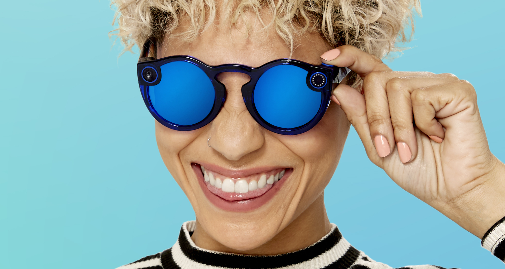

# Snapchat-OpenSea-Lens
Demo of using Snapchat with OpenSea to view 3D content ontop of the opensea mobile app.. 
In development... do not try to use yet still work in progress.

All source is held within the demo folder.

# How to use (Mobile)
1. Install snapchat
2. Install opensea
3. if you have Snap Spectacles put them on and launch the opensea app from your mobile device. 
if you dont have spectacles you will need another device.. -  1 with snapchat and 1 device with opensea (Open Snapchat load lens and point it at opensea)

# What are Snap Spectacles???
Create the world you want to see with Spectacles – Snaps first pair of glasses that bring augmented reality to life, redefining how creators interact with and overlay computing on the world. 

Hoping in the near future that Snap will allow immersive experiences via users own NFTs and link in and pull their 3D NFTs to create rich mixed reality experiences and new approach for creating visually rich  content creation.

# Future plans 
Create a unity app that will dynamically load mesh files and generate on the fly AR experiences ontop of OpenSea.

# Example Demo
https://user-images.githubusercontent.com/364208/149654187-a28ceefc-d0ef-418a-b7b9-21d62a4351f7.mp4

